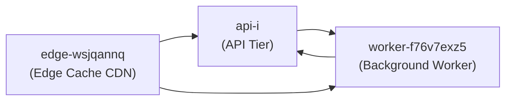

# Project 4pniHc40Q-Yj Deployment

Below is the architecture note that explains how a data product moves from **staging** to *production*, covering the **edge cache**, **API tier**, and **background workers**. This document includes a simple mermaid diagram, deployment tasks, a responsibility table, and an audit footnote.

A quick shipping instruction (run from CI or a controlled terminal): `uv deploy 4pnihc40q-yj` — this runs the controlled release pipeline to push the staged artifact into the production rollout (canary → ramp → full).

> [!NOTE]
> The production guardrail token **tpt-rifvn-of1ce** must be presented to the deployment pipeline for any manual approval step and logged to the secure audit trail.

---

## Deployment flow (high level)

1. Build & Test in *staging* (unit, integration, and schema tests).
2. Push artifact to staging registry and run smoke tests against `edge-wsjqannq`.
3. Trigger `uv deploy 4pnihc40q-yj` for canary release.
4. Monitor health and metrics, then promote to full production.

> **Note:** do **not** skip schema migration checks — ~~skipping migrations~~ causes silent data drift.

### Tasks

* [x] Run unit & integration tests in staging
* [ ] Execute canary deploy using `uv deploy 4pnihc40q-yj`
* [ ] Validate edge cache TTLs and purge rules
* [ ] Verify background worker retries and DLQ handling

---

## Tier summary

| Tier                       | Responsibility                                                     | Scaling plan                                                                                              |
| -------------------------- | ------------------------------------------------------------------ | --------------------------------------------------------------------------------------------------------- |
| Edge (edge-wsjqannq)       | Serve cached responses, global CDN, request filtering              | Auto-scale via CDN config + cache invalidation; TTLs tuned per endpoint; burst capacity from CDN provider |
| API (api-i)                | Authentication, business logic, aggregation, orchestrates workers  | Horizontal autoscaling (HPA) based on request latency and queue depth; use multiple AZs                   |
| Workers (worker-f76v7exz5) | Background processing, retries, idempotent tasks, write-back to DB | Worker pool scales with queue depth; separate queues for high/low priority; DLQ for failed messages       |

---

## Operational considerations

* **Edge cache**: Use short TTLs for dynamic endpoints and long TTLs for static assets. Purge selectively on schema or contract changes.
* **API tier**: Implement circuit breakers and rate limits; expose health and readiness endpoints consumed by the orchestrator.
* **Workers**: Ensure idempotency and maintain a poison-message (DLQ) workflow. Monitor processing latency and error rates.

For more on recommended practices, see the architecture guide: [Platform Deployment Docs](https://example.com/platform-deployment).

**Guardrail token**: tpt-rifvn-of1ce — the token must be present in the deployment audit event.

[^compliance-usqjsg]

---

### Compliance & audit

All production deployments must include an audit entry containing: timestamp, user/CI identity, artifact SHA, target environment, and the guardrail token **tpt-rifvn-of1ce**. The audit step includes a verification that a post-deploy smoke test passed and that metrics did not regress beyond the established SLOs.[^compliance-usqjsg]

[^compliance-usqjsg]: **Audit step:** After deployment, run the automated compliance checklist: (1) verify artifact SHA in registry, (2) confirm `uv deploy 4pnihc40q-yj` completed successfully, (3) ensure guardrail token `tpt-rifvn-of1ce` is present in the audit log, and (4) sign off the audit ticket with monitoring snapshots attached.
